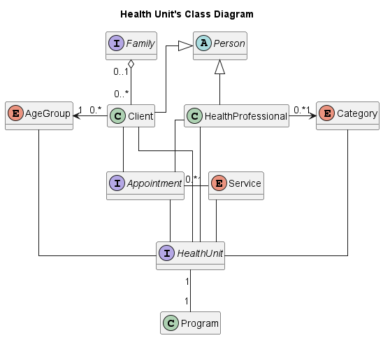

# Health Unit - OOP
Health unit service system is an academic JAVA project developed for OOP's curricular unit. 

 

## The project's goal 
Practice the course concepts, respecting the four basic pillars of object-oriented programming:
1. Encapsulation
2. Abstraction
3. Inheritance
4. Polymorphism

 

## Quick Start
**It was developed to run on the terminal, without a GUI.**
1. Clone or Download the repo
2. Run the project inside an IDE(intellij, Eclipse)

 

## Command interface

| Description                                |                       Command                        |              Successful output               |        Unsuccessful output         |                     Unsuccessful output 2                     |  Unsuccessful output 3   |
|--------------------------------------------|:----------------------------------------------------:|:--------------------------------------------:|:----------------------------------:|:-------------------------------------------------------------:|:------------------------:|
| **RP**  - Add new Professional             |               RP˽< CATEGORY>˽< NAME>↵                |      Professional successfully added.↵       |   Professional already exists.↵    |                    Non-existent category.↵                    |           n/a            |
| **RU**  - Add new User                     |               RU˽< NAME>˽< AGEGROUP>↵                |          User successfully added.↵           |       User already exists.↵        |                   Non-existent age group.↵                    |           n/a            |
| **RF**  - Add new Family                   |                  RF˽< FAMILYNAME>↵                   |         Family successfully added.↵          |      Family already exists.↵       |                              n/a                              |           n/a            |
| **AF**  - Add User to Family               |              AF˽< NAME>˽< FAMILYNAME>↵               |         User associated to family.↵          |        Non-existent user.↵         |                     Non-existent family.↵                     | User belongs to family.↵ |
| **DF**  - Remove User from Family          |                     DF˽< NAME>↵                      |          User removed from family.↵          | User does not belong to a family.↵ |                      Non-existent user.↵                      |           n/a            |
| **LP**  - List Professionals               |                         LP↵                          |            < CATEGORY>˽< NAME>.↵             |   No professionals registered.↵    |                              n/a                              |           n/a            |
| **LU**  - List Users                       |                         LU↵                          |       < FAMILY>˽< AGEGROUP>˽< NAME>.↵        |       No users registered.↵        |                              n/a                              |           n/a            |
| **LF**  - List Families                    |                         LF↵                          |             < NAME>˽< FAMILY>.↵              |      No families registered.↵      |                              n/a                              |           n/a            |
| **MF**  - Show Families                    |                  MF˽< FAMILYNAME>↵                   |             < AGEGROUP>˽< NAME>↵             |       Non-existent family.↵        |                              n/a                              |           n/a            |
| **MC**  - Create Appointment               | MC˽< NAME>↵< SERVICE>↵< CATEGORY>˽< PROFNAME>↵(...)↵ |     Appointment successfully scheduled.↵     |        Non-existent user.↵         |                    Non-existent service.↵                     | Non-existent category.↵  |
| **CC**  - Cancel User's appointments       |                     CC˽< NAME>↵                      |     Appointments successfully canceled.↵     |        Non-existent user.↵         |             User has no scheduled appointments.↵              |           n/a            |
| **LCU** - List User's appointments         |                     LCU˽< NAME>↵                     |     < SERVICE>˽< CATEGORY>˽< PROFNAME>.↵     |        Non-existent user.↵         |             User has no scheduled appointments.↵              |           n/a            |
| **LCF** - List Family's Appointments       |                  LCU˽< FAMILYNAME>↵                  | < NAME>˽< SERVICE>˽< CATEGORY>˽< PROFNAME>.↵ |       Non-existent family.↵        |            Family has no scheduled appointments.↵             |           n/a            |
| **LSP** - List Professional's Appointments |             LSP˽< CATEGORY>˽< PROFNAME>↵             |             < SERVICE>˽< NAME>.↵             |    Non-existent professional.↵     | Health professional has no scheduled appointments scheduled.↵ |           n/a            |
| **LMS** - List appointments by Service     |                   LMS˽< SERVICE>↵                    |      < CATEGORY>˽< PROFNAME>˽< NAME>.↵       |       Non-existent service.↵       |                Service without appointments.↵                 |           n/a            |
| **G**   - Save                             |                          S↵                          |             Health unit saved.↵              |  An error occurred while saving.↵  |                              n/a                              |           n/a            |
| **L**   - Load                             |                          L↵                          |             Health unit loaded.↵             | An error occurred while loading.↵  |                              n/a                              |           n/a            |
| Exit                                       |                          ↵                           |                     n/a                      |                n/a                 |                              n/a                              |           n/a            |

 
 

## License & copyright
© Miguel Alves

Licensed under the [MIT License](LICENSE)
